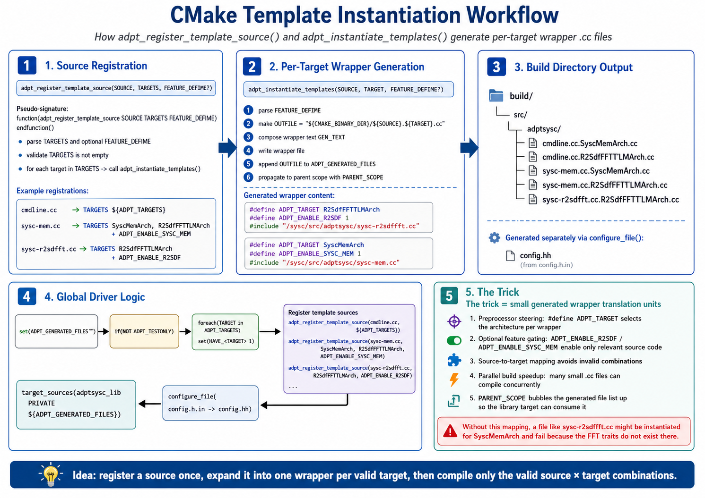

# CMake Template-Instantiation Trick



## Goal

This project uses many template-based `.cc` sources whose implementation depends on an architecture type such as `SyscMemArch` or `R2SdfFFTTLMArch`.

If we compile every template source for every target, we will eventually hit invalid source × target combinations.  
A typical example is:

- `sysc-r2sdffft.cc` should only be compiled for FFT-related targets
- it should **not** be instantiated for `SyscMemArch`

The CMake trick in this project is:

1. register a template source once
2. expand it into one tiny generated wrapper `.cc` per valid target
3. compile only the valid source × target combinations

This keeps the build scalable and avoids trait-mismatch errors.

---

## Core Idea

Instead of compiling a template source file directly, CMake first generates a small wrapper file like this:

```cpp
#define ADPT_TARGET R2SdfFFTTLMArch
#define ADPT_ENABLE_R2SDF 1
#include "/sysc/src/adptsysc/sysc-r2sdffft.cc"
```

Then the original template implementation file is compiled **through the wrapper**.

This means the same template `.cc` file can be reused, but only for the architecture types that are explicitly allowed.

---

## Why this is needed

A template implementation file may look generic, but internally it may depend on architecture-specific traits.

For example, an FFT TLM source may expect things like:

```cpp
typename E::Eval_T
typename E::CxEval_T
R2SDF-specific ports
R2SDF-specific helper functions
FFT-specific runtime behavior
```

Those assumptions are valid for:

```cpp
R2SdfFFTTLMArch
```

but not valid for:

```cpp
SyscMemArch
```

Therefore, blindly compiling:

```cpp
sysc-r2sdffft.cc
```

for every architecture target can cause errors such as:

```text
error: no type named ...
error: member function not declared
error: trait mismatch
error: this source should not be instantiated for this architecture
```

The wrapper-generation method solves this by making the valid combinations explicit.

---

## Correct build model

The project should follow this model:

```text
template source
    |
    | registered once in CMake
    v
valid architecture list
    |
    | CMake generates one wrapper per valid architecture
    v
generated wrapper .cc files
    |
    | each wrapper defines ADPT_TARGET and feature flags
    v
actual template .cc is included and instantiated
```

For example:

```text
sysc-r2sdffft.cc
    |
    +--> generated/r2sdf/sysc-r2sdffft.R2SdfFFTTLMArch.cc
    |
    +--> compiled only for R2SdfFFTTLMArch
```

It should **not** become:

```text
sysc-r2sdffft.cc
    |
    +--> compiled for SyscMemArch
    +--> compiled for LMSArch
    +--> compiled for APAArch
    +--> compiled for R2SdfFFTTLMArch
```

because most of those combinations are invalid.

---

## Important rule

Do **not** directly add template `.cc` files to the main target like this:

```cmake
target_sources(adptsysc PRIVATE
  sysc-r2sdffft.cc
)
```

That bypasses the wrapper system.

Instead, register the source with the template-instantiation helper and specify the valid architecture targets.

---

## Source-side pattern

A template `.cc` file should assume that `ADPT_TARGET` is provided by the generated wrapper.

A typical source file should look like this:

```cpp
#include "arch.hh"
#include "config.hh"

#ifndef ADPT_TARGET
#error "ADPT_TARGET must be defined by the generated CMake wrapper"
#endif

namespace adptsysc {

using ActiveArch = ADPT_TARGET;

// implementation for ActiveArch goes here

} // namespace adptsysc
```

For a source that is only valid for one feature family, add a feature guard:

```cpp
#ifndef ADPT_ENABLE_R2SDF
#error "sysc-r2sdffft.cc requires ADPT_ENABLE_R2SDF"
#endif
```

This makes mistakes fail early with a clear error message.

---

## Example: R2SDF FFT source

The generated wrapper may look like:

```cpp
#define ADPT_TARGET R2SdfFFTTLMArch
#define ADPT_ENABLE_R2SDF 1
#include "/sysc/src/adptsysc/sysc-r2sdffft.cc"
```

Then inside `sysc-r2sdffft.cc`:

```cpp
#include "arch.hh"
#include "config.hh"

#ifndef ADPT_TARGET
#error "ADPT_TARGET is not defined"
#endif

#ifndef ADPT_ENABLE_R2SDF
#error "sysc-r2sdffft.cc can only be compiled for R2SDF FFT targets"
#endif

namespace adptsysc {

using Arch = ADPT_TARGET;

template class R2SdfFFTTLM<Arch>;

} // namespace adptsysc
```

The important point is that the source is compiled only for the valid architecture.

---

## Common mistake: helper function not declared

A common error looks like this:

```text
error: there are no arguments to 'shiftreg_clear_tlm' that depend on a template parameter,
so a declaration of 'shiftreg_clear_tlm' must be available
```

This usually means one of these happened:

1. the helper function is not declared before it is used
2. the helper function is outside the enabled feature block
3. the helper function is not a member function but is called like one
4. the wrong source was compiled for the wrong architecture
5. the generated wrapper did not define the required feature flag

For template code, non-dependent names must be declared before the template is parsed.

Bad pattern:

```cpp
template <typename E>
void R2SdfFFTTLM<E>::state_reset() {
  shiftreg_clear_tlm();
}

void shiftreg_clear_tlm() {
  // declared too late
}
```

Better pattern:

```cpp
template <typename E>
void R2SdfFFTTLM<E>::shiftreg_clear_tlm() {
  // clear shift registers
}

template <typename E>
void R2SdfFFTTLM<E>::state_reset() {
  this->shiftreg_clear_tlm();
}
```

Or, if it is a free helper function:

```cpp
namespace {

void shiftreg_clear_tlm_impl() {
  // helper implementation
}

} // anonymous namespace

template <typename E>
void R2SdfFFTTLM<E>::state_reset() {
  shiftreg_clear_tlm_impl();
}
```

For member functions, prefer using:

```cpp
this->helper_name();
```

inside template code.

---

## How to add a new design in both CMake and source code

Take **LMS** as an example.

In this project, adding a new design usually means updating **four layers** together:

1. **architecture definition** in `arch.hh`
2. **enable the config** in `config.h.in` / generated `config.hh`
3. **runtime dispatch** in `adptsysc-main.cc`
4. **build-time registration** in `CMakeLists.txt`

---

## Important note about `config.h.in` and `config.hh`

In this project:

- `config.h.in` is the **template file maintained by developers**
- `config.hh` is the **generated file produced by CMake**

So the correct workflow is:

- edit **`config.h.in`** if the config template itself needs to change
- edit **`CMakeLists.txt`** to control which `HAVE_*` macros are generated
- do **not** manually edit **`config.hh`** in normal development

### Correct mental model

```text
config.h.in  --(configure_file by CMake)-->  config.hh
```

So if you need a new macro such as:

```cpp
HAVE_ADPTSYSC_LMS
```

you usually add this to `config.h.in`:

```cpp
#cmakedefine01 HAVE_ADPTSYSC_LMS
```

Then CMake decides whether it becomes:

```cpp
#define HAVE_ADPTSYSC_LMS 1
```

or:

```cpp
#define HAVE_ADPTSYSC_LMS 0
```

in the generated `config.hh`.

---

## Step 1: Add architecture definition in `arch.hh`

Add a new architecture type for the design.

Example:

```cpp
struct LMSArch {
  static constexpr const char* name = "lms";

  using Eval_T = float;
  using Train_T = float;

  static constexpr bool is_le = true;
  static constexpr bool is_64 = false;
};
```

The exact fields depend on what the design source expects.

The important rule is:

> Every template source should only be instantiated for architecture types that provide the required traits.

For example, if `sysc-lms.cc` expects:

```cpp
typename E::Eval_T
E::name
E::is_le
```

then `LMSArch` must define those fields.

---

## Step 2: Add config option in `config.h.in`

Add a macro entry:

```cpp
#cmakedefine01 HAVE_ADPTSYSC_LMS
```

This gives source code a stable way to check whether LMS support was built.

Example source-side use:

```cpp
#if HAVE_ADPTSYSC_LMS
// LMS-related code
#endif
```

Do not manually edit the generated `config.hh`.

---

## Step 3: Enable the config in `CMakeLists.txt`

In CMake, define whether the design is enabled.

Example:

```cmake
option(ADPTSYSC_ENABLE_LMS "Enable LMS SystemC design" ON)

if(ADPTSYSC_ENABLE_LMS)
  set(HAVE_ADPTSYSC_LMS 1)
else()
  set(HAVE_ADPTSYSC_LMS 0)
endif()

configure_file(
  ${CMAKE_CURRENT_SOURCE_DIR}/config.h.in
  ${CMAKE_CURRENT_BINARY_DIR}/config.hh
)
```

If the project already has a central list of enabled designs, add LMS there instead of creating a separate option.

The key idea is:

```text
CMake option/list
    |
    v
HAVE_ADPTSYSC_LMS
    |
    v
generated config.hh
    |
    v
source code can use #if HAVE_ADPTSYSC_LMS
```

---

## Step 4: Register the template source in CMake

The LMS implementation source should not be compiled directly.

Bad:

```cmake
target_sources(adptsysc PRIVATE
  sysc-lms.cc
)
```

Good:

```cmake
adpt_register_template_source(
  SOURCE sysc-lms.cc
  TARGETS LMSArch
  DEFINES ADPT_ENABLE_LMS=1
)
```

The exact helper name may differ in the project, but the idea should remain the same:

```text
source:  sysc-lms.cc
target:  LMSArch
define:  ADPT_ENABLE_LMS=1
```

If one source supports multiple architectures, list only the valid ones:

```cmake
adpt_register_template_source(
  SOURCE sysc-common-filter.cc
  TARGETS LMSArch APAArch FDAFArch
  DEFINES ADPT_ENABLE_FILTER=1
)
```

Do not include unrelated architectures.

---

## Step 5: Add runtime dispatch in `adptsysc-main.cc`

The build step controls what gets compiled.

The runtime dispatch controls what gets selected when the executable runs.

Example:

```cpp
#include "config.hh"
#include "arch.hh"

int main(int argc, char** argv) {
  std::string design = parse_design_name(argc, argv);

#if HAVE_ADPTSYSC_LMS
  if (design == "lms") {
    return run_design<LMSArch>(argc, argv);
  }
#endif

  std::cerr << "Unknown or disabled design: " << design << std::endl;
  return 1;
}
```

This prevents runtime code from referencing a design that was not built.

The pattern should be:

```cpp
#if HAVE_ADPTSYSC_LMS
  if (design == "lms") {
    return run_design<LMSArch>(argc, argv);
  }
#endif
```

Do not write:

```cpp
if (design == "lms") {
  return run_design<LMSArch>(argc, argv);
}
```

unless LMS is always built.

---

## Step 6: Add the implementation source

Create the design implementation source, for example:

```text
sysc/src/adptsysc/sysc-lms.cc
```

Use the wrapper-driven pattern:

```cpp
#include "arch.hh"
#include "config.hh"

#ifndef ADPT_TARGET
#error "ADPT_TARGET must be defined by CMake generated wrapper"
#endif

#ifndef ADPT_ENABLE_LMS
#error "sysc-lms.cc requires ADPT_ENABLE_LMS"
#endif

namespace adptsysc {

using Arch = ADPT_TARGET;

template class LMSFilter<Arch>;

} // namespace adptsysc
```

If the source contains full method definitions:

```cpp
template <typename E>
void LMSFilter<E>::state_reset() {
  // reset internal state
}

template <typename E>
void LMSFilter<E>::process_sample() {
  // process one sample
}

template class LMSFilter<ADPT_TARGET>;
```

Keep the explicit instantiation at the bottom of the file.

---

## Recommended file responsibility

### `arch.hh`

Defines architecture traits.

Example responsibility:

```cpp
struct LMSArch {
  using Eval_T = float;
  static constexpr const char* name = "lms";
};
```

### `config.h.in`

Defines configurable feature macros.

Example responsibility:

```cpp
#cmakedefine01 HAVE_ADPTSYSC_LMS
```

### `CMakeLists.txt`

Selects valid source × architecture combinations.

Example responsibility:

```cmake
adpt_register_template_source(
  SOURCE sysc-lms.cc
  TARGETS LMSArch
  DEFINES ADPT_ENABLE_LMS=1
)
```

### `adptsysc-main.cc`

Maps runtime design names to architecture types.

Example responsibility:

```cpp
#if HAVE_ADPTSYSC_LMS
if (design == "lms") {
  return run_design<LMSArch>(argc, argv);
}
#endif
```

### `sysc-lms.cc`

Implements and explicitly instantiates the template for the active wrapper target.

Example responsibility:

```cpp
template class LMSFilter<ADPT_TARGET>;
```

---

## Source compatibility checklist

Before adding a source to a target list, check the following:

- Does the architecture define all required type aliases?
- Does the architecture define all required constants?
- Does the source require SystemC?
- Does the source require TLM?
- Does the source require FFT-specific helpers?
- Does the source require memory-specific helpers?
- Does the source require adaptive-filter-specific helpers?
- Does the source require fixed-point types?
- Does the source require floating-point types?
- Does the source require runtime JSON configuration?

Only register the source for architectures that satisfy the requirements.

---

## Example source × target table

| Source file | Valid architecture | Feature define |
|---|---|---|
| `sysc-mem.cc` | `SyscMemArch` | `ADPT_ENABLE_SYSC_MEM=1` |
| `sysc-r2sdffft.cc` | `R2SdfFFTTLMArch` | `ADPT_ENABLE_R2SDF=1` |
| `sysc-lms.cc` | `LMSArch` | `ADPT_ENABLE_LMS=1` |
| `sysc-apa.cc` | `APAArch` | `ADPT_ENABLE_APA=1` |
| `sysc-fdaf.cc` | `FDAFArch` | `ADPT_ENABLE_FDAF=1` |

This table is the main design rule.

If a source is not valid for an architecture, do not rely on `if constexpr` alone.  
Do not compile that combination in the first place.

---

## Difference between build-time enable and runtime selection

There are two different concepts:

```text
Build-time enable:
  Should this design be compiled into the binary?

Runtime selection:
  Which compiled design should run now?
```

For example:

```text
HAVE_ADPTSYSC_LMS=1
```

means LMS support exists in the binary.

But the runtime still needs:

```text
--design lms
```

or equivalent to select it.

A disabled design should fail cleanly:

```text
Unknown or disabled design: lms
```

not with a linker error or template-instantiation error.

---

## Avoiding linker errors

For template classes implemented in `.cc` files, the compiler needs explicit instantiation.

Example:

```cpp
template class LMSFilter<LMSArch>;
```

With the wrapper trick, this becomes:

```cpp
template class LMSFilter<ADPT_TARGET>;
```

because the generated wrapper defines:

```cpp
#define ADPT_TARGET LMSArch
```

Without explicit instantiation, you may see linker errors such as:

```text
undefined reference to adptsysc::LMSFilter<LMSArch>::process_sample()
undefined reference to adptsysc::LMSFilter<LMSArch>::state_reset()
```

The fix is usually to add the explicit instantiation at the bottom of the template `.cc`.

---

## Avoiding duplicate-symbol errors

Do not instantiate the same template source for the same architecture more than once.

Bad:

```cmake
adpt_register_template_source(
  SOURCE sysc-lms.cc
  TARGETS LMSArch
)

adpt_register_template_source(
  SOURCE sysc-lms.cc
  TARGETS LMSArch
)
```

This may produce duplicate symbols.

Also avoid compiling both:

```text
sysc-lms.cc
```

and:

```text
generated/sysc-lms.LMSArch.cc
```

Only the generated wrapper should be compiled.

---

## Debugging generated wrappers

When debugging CMake issues, inspect the build directory.

Look for generated files similar to:

```text
build/generated/sysc-lms.LMSArch.cc
build/generated/sysc-r2sdffft.R2SdfFFTTLMArch.cc
```

Open the generated wrapper and verify that it contains the expected macros:

```cpp
#define ADPT_TARGET LMSArch
#define ADPT_ENABLE_LMS 1
#include "/absolute/path/to/sysc-lms.cc"
```

If the wrong architecture appears there, the CMake registration is wrong.

If the feature macro is missing, the `DEFINES` list is wrong.

If the source is included directly elsewhere, remove the direct `target_sources()` entry.

---

## Debugging invalid source × target combinations

If an error mentions a type or member that should only exist in another design, suspect that a source was instantiated for the wrong architecture.

Example:

```text
sysc-r2sdffft.cc
error: 'shiftreg_clear_tlm' was not declared
```

Ask:

1. Was `sysc-r2sdffft.cc` compiled through a generated wrapper?
2. Did the wrapper define `ADPT_TARGET R2SdfFFTTLMArch`?
3. Did the wrapper define `ADPT_ENABLE_R2SDF`?
4. Was `sysc-r2sdffft.cc` accidentally compiled directly?
5. Was it accidentally registered for `SyscMemArch` or another non-FFT architecture?

Most build errors in this system are caused by one of these.

---

## Recommended CMake helper behavior

The helper should conceptually do this:

```cmake
function(adpt_register_template_source)
  # Input:
  #   SOURCE  sysc-lms.cc
  #   TARGETS LMSArch
  #   DEFINES ADPT_ENABLE_LMS=1
  #
  # Output:
  #   generated/sysc-lms.LMSArch.cc
endfunction()
```

For each architecture target, it generates a wrapper:

```cpp
#define ADPT_TARGET LMSArch
#define ADPT_ENABLE_LMS 1
#include "/absolute/path/to/sysc-lms.cc"
```

Then it adds the generated wrapper to the real library or executable target.

The generated wrapper is the only file that should be compiled.

---

## Example generated wrapper template

CMake may use a file like:

```cpp
// template_instantiation.cc.in

#define ADPT_TARGET @ADPT_TARGET@
@ADPT_EXTRA_DEFINES@

#include "@ADPT_TEMPLATE_SOURCE@"
```

Then CMake fills it in:

```cpp
#define ADPT_TARGET LMSArch
#define ADPT_ENABLE_LMS 1

#include "/sysc/src/adptsysc/sysc-lms.cc"
```

---

## Example CMake pseudo-implementation

```cmake
function(adpt_add_template_instantiation out_var source arch)
  get_filename_component(source_abs "${source}" ABSOLUTE)
  get_filename_component(source_name "${source}" NAME)

  set(generated
    "${CMAKE_CURRENT_BINARY_DIR}/generated/${source_name}.${arch}.cc"
  )

  file(WRITE "${generated}"
"#define ADPT_TARGET ${arch}
#include \"${source_abs}\"
"
  )

  set(${out_var} "${generated}" PARENT_SCOPE)
endfunction()
```

A fuller version should also support extra defines:

```cmake
function(adpt_add_template_instantiation out_var source arch)
  set(options)
  set(oneValueArgs)
  set(multiValueArgs DEFINES)
  cmake_parse_arguments(ARG "${options}" "${oneValueArgs}" "${multiValueArgs}" ${ARGN})

  get_filename_component(source_abs "${source}" ABSOLUTE)
  get_filename_component(source_name "${source}" NAME)

  set(generated
    "${CMAKE_CURRENT_BINARY_DIR}/generated/${source_name}.${arch}.cc"
  )

  set(define_text "#define ADPT_TARGET ${arch}\n")

  foreach(def ${ARG_DEFINES})
    string(APPEND define_text "#define ${def}\n")
  endforeach()

  file(WRITE "${generated}"
"${define_text}
#include \"${source_abs}\"
"
  )

  set(${out_var} "${generated}" PARENT_SCOPE)
endfunction()
```

This is only the conceptual behavior.  
Use the actual helper already defined in this project if one exists.

---

## Adding LMS: full checklist

### 1. Add architecture

File:

```text
arch.hh
```

Add:

```cpp
struct LMSArch {
  static constexpr const char* name = "lms";

  using Eval_T = float;
  using Train_T = float;

  static constexpr bool is_le = true;
  static constexpr bool is_64 = false;
};
```

---

### 2. Add config macro

File:

```text
config.h.in
```

Add:

```cpp
#cmakedefine01 HAVE_ADPTSYSC_LMS
```

---

### 3. Enable macro from CMake

File:

```text
CMakeLists.txt
```

Add or update:

```cmake
option(ADPTSYSC_ENABLE_LMS "Enable LMS design" ON)

if(ADPTSYSC_ENABLE_LMS)
  set(HAVE_ADPTSYSC_LMS 1)
else()
  set(HAVE_ADPTSYSC_LMS 0)
endif()
```

Make sure this happens before:

```cmake
configure_file(...)
```

---

### 4. Register template source

File:

```text
CMakeLists.txt
```

Add conceptually:

```cmake
adpt_register_template_source(
  SOURCE sysc-lms.cc
  TARGETS LMSArch
  DEFINES ADPT_ENABLE_LMS=1
)
```

Do not directly compile `sysc-lms.cc`.

---

### 5. Add runtime dispatch

File:

```text
adptsysc-main.cc
```

Add:

```cpp
#if HAVE_ADPTSYSC_LMS
  if (design == "lms") {
    return run_design<LMSArch>(argc, argv);
  }
#endif
```

---

### 6. Add implementation source

File:

```text
sysc-lms.cc
```

Add:

```cpp
#include "arch.hh"
#include "config.hh"

#ifndef ADPT_TARGET
#error "ADPT_TARGET must be defined by generated wrapper"
#endif

#ifndef ADPT_ENABLE_LMS
#error "sysc-lms.cc requires ADPT_ENABLE_LMS"
#endif

namespace adptsysc {

using Arch = ADPT_TARGET;

// method definitions here

template class LMSFilter<Arch>;

} // namespace adptsysc
```

---

## Naming convention

Recommended naming:

| Concept | Example |
|---|---|
| Architecture type | `LMSArch` |
| Runtime design name | `"lms"` |
| Build option | `ADPTSYSC_ENABLE_LMS` |
| Generated config macro | `HAVE_ADPTSYSC_LMS` |
| Wrapper feature define | `ADPT_ENABLE_LMS` |
| Source file | `sysc-lms.cc` |

Try to keep these names aligned.

This makes it easy to trace one design across:

```text
arch.hh
config.h.in
CMakeLists.txt
adptsysc-main.cc
sysc-lms.cc
```

---

## Final build sanity checklist

After adding a design, check:

- `config.h.in` contains the `HAVE_*` macro
- CMake sets the `HAVE_*` macro before `configure_file`
- `config.hh` is generated, not manually edited
- architecture type exists in `arch.hh`
- runtime dispatch is protected by `#if HAVE_*`
- template `.cc` is not compiled directly
- template `.cc` is registered only for valid architecture targets
- generated wrapper contains the correct `ADPT_TARGET`
- generated wrapper contains the correct `ADPT_ENABLE_*`
- template implementation ends with explicit instantiation
- helper functions are declared before use
- template member helper calls use `this->helper()` when needed

---

## Summary

The CMake template-instantiation trick exists to prevent invalid template instantiations.

The rule is:

```text
Do not compile template .cc files directly.
Compile generated wrappers instead.
```

Each generated wrapper chooses exactly one architecture:

```cpp
#define ADPT_TARGET SomeArch
```

and enables exactly the required feature flags:

```cpp
#define ADPT_ENABLE_SOME_DESIGN 1
```

This gives the project a clean separation between:

```text
what source code exists
```

and:

```text
which architecture that source code is valid for
```

When adding a new design, always update these layers together:

```text
arch.hh
config.h.in
CMakeLists.txt
adptsysc-main.cc
design implementation .cc
```

This keeps the build scalable, avoids trait-mismatch errors, and makes template instantiation explicit and predictable.